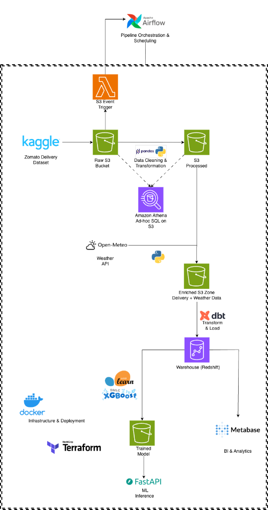

# Delivery Data Platform

This repository contains an end-to-end data engineering and machine learning pipeline. The primary goal of this project is to process historical food delivery data, enrich it with external weather information, and predict the estimated delivery time for new orders.

It is designed as a batch-processing architecture that demonstrates how to move data from a raw source all the way to a machine learning inference API.

  

## Architecture and Technologies

The project relies on a modern data stack to handle different stages of the data lifecycle:

* Infrastructure: AWS (S3, Redshift, Athena, Lambda, IAM) managed via Terraform.
* Orchestration: Apache Airflow (triggered via AWS Lambda events).
* Data Processing: Python (Pandas) for data cleaning and Parquet conversion.
* Data Warehousing: dbt (data build tool) for dimensional modeling on Redshift.
* Machine Learning: scikit-learn for preprocessing pipelines and XGBoost for regression.
* Serving & BI: FastAPI for real-time model serving and Metabase for data visualization.
* Dependency Management: uv.

> **Note on AWS Costs:** This project uses Redshift Serverless (minimum 8 RPU) and other AWS services. It is designed as a portfolio project. To avoid unexpected charges, remember to run `terraform destroy` when not actively developing.

## Pipeline Overview

The data pipeline consists of the following sequential steps:

1. **Data Ingestion:** Raw delivery data is downloaded from Kaggle and stored in an AWS S3 raw zone. An AWS Lambda function listens for S3 `ObjectCreated` events and triggers the Airflow pipeline REST API.
2. **Processing:** The data is cleaned and standardized. Geographic distances between restaurants and delivery locations are calculated using the Haversine formula. The processed data is saved in Parquet format.
3. **Enrichment:** Historical weather data (temperature, wind speed, precipitation) is retrieved from the Open-Meteo API based on delivery coordinates and timestamps (grouped/batched to minimize API calls). This is merged with the delivery dataset strictly maintaining a 1-to-1 row cardinality.
4. **Data Warehousing & Exploration:** 
   * **Amazon Athena:** Used for ad-hoc exploration, data quality investigation, and querying the S3 raw and processed data lake zones efficiently.
   * **Amazon Redshift & dbt:** Curated analytical dimensional models (Star Schema) are built here for downstream ML feature extraction and BI dashboards.
5. **Machine Learning:** Data observability checks run to ensure data quality and catch anomalies (e.g., impossible coordinates/temperatures). An XGBoost regression model is then trained using a chronological temporal split to predict delivery durations.
   * **Prediction Point:** The model is designed to predict delivery time *post-courier assignment*. It uses features available at that specific time (e.g., courier age/rating, weather, traffic).
6. **Serving:** A FastAPI application downloads the latest model from S3 and exposes a REST API endpoint to serve real-time predictions.

## Local Setup

You can run the application locally using Docker Compose, which brings up the FastAPI service, Airflow, and Metabase.

1. Clone the repository to your local machine.
2. Copy the `.env.example` file to a new file named `.env` and fill in your AWS and Kaggle credentials.
3. Run `docker compose up -d` to build and start the containers.
4. The API will be accessible at `http://localhost:8000` and Metabase at `http://localhost:3000`.

To provision the cloud resources, navigate to the `terraform/` directory, initialize Terraform, and run `terraform apply`.

## Continuous Integration

The project includes a GitHub Actions workflow that automatically runs code linting (Ruff), type checking (Mypy), and unit tests (Pytest) on every push to the main branch.
